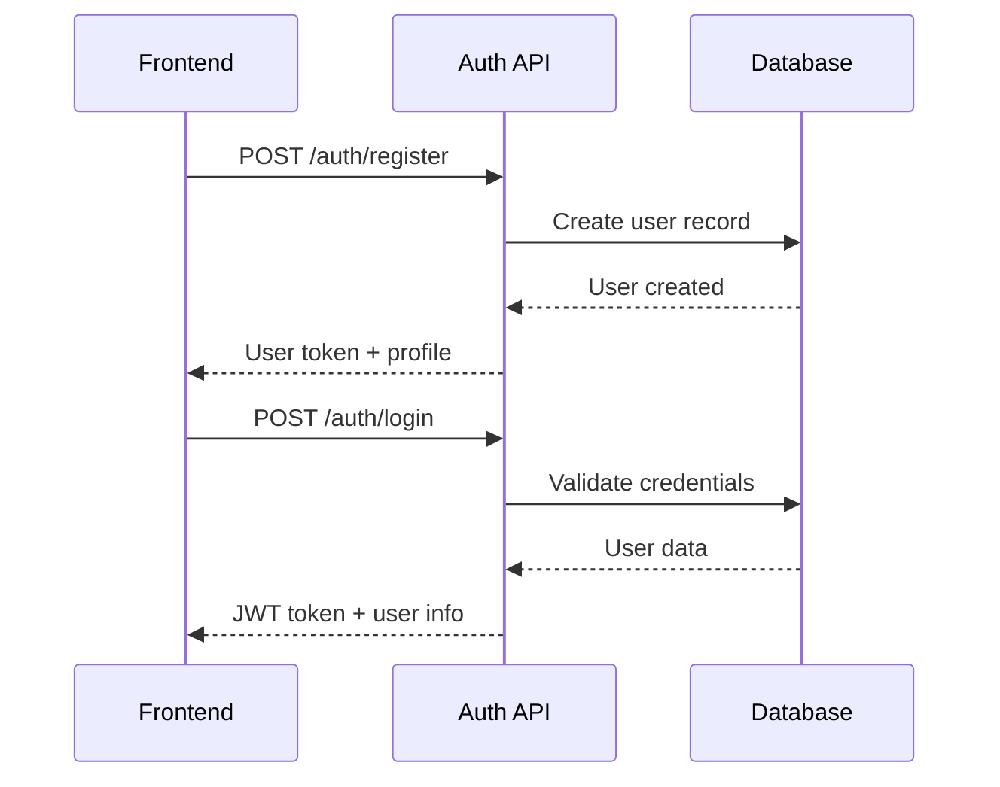
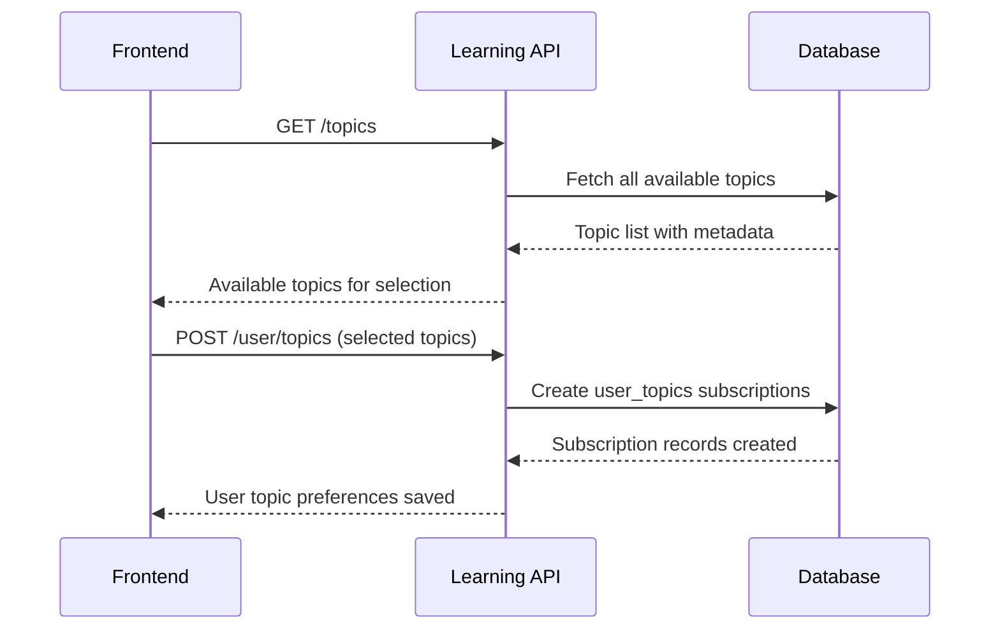
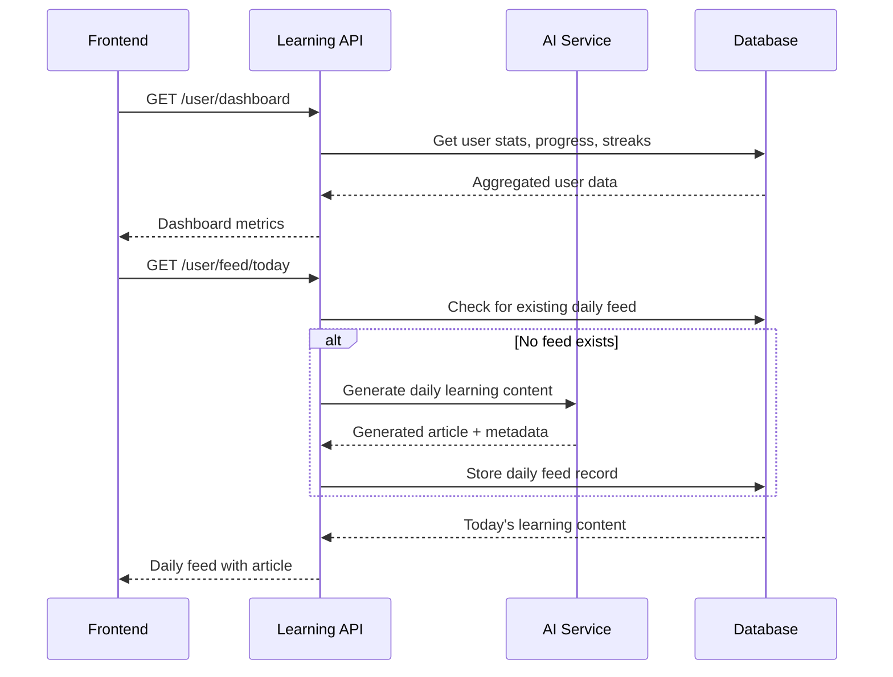
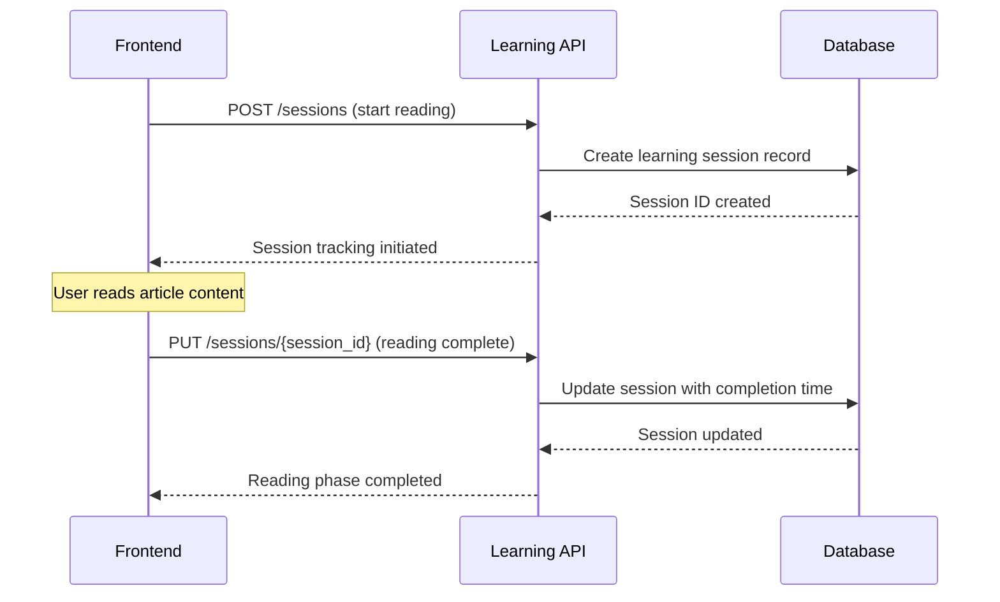
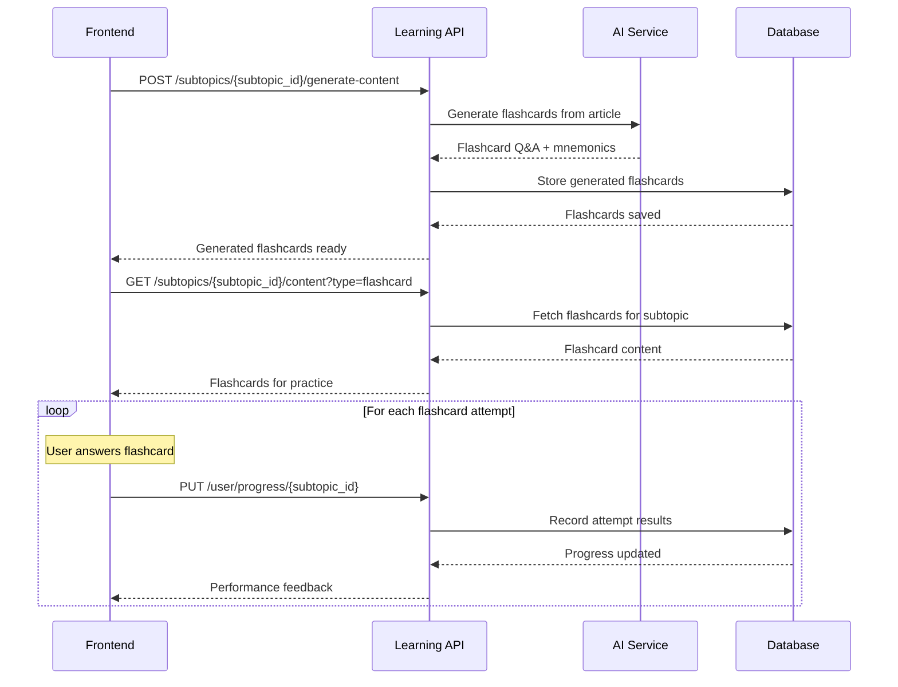
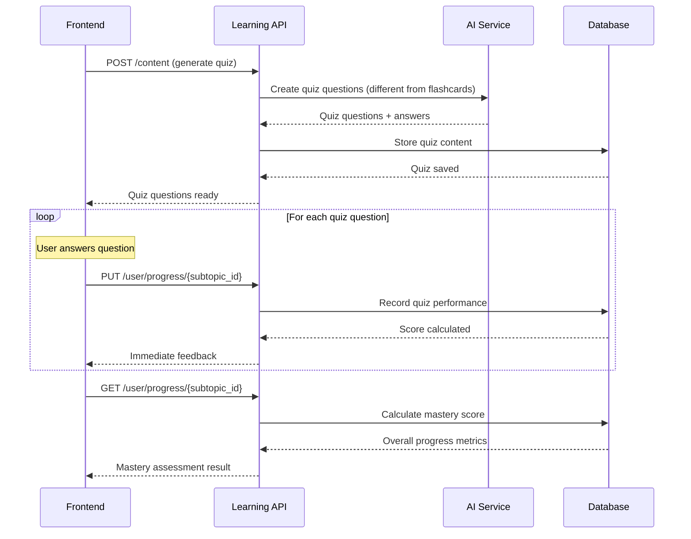
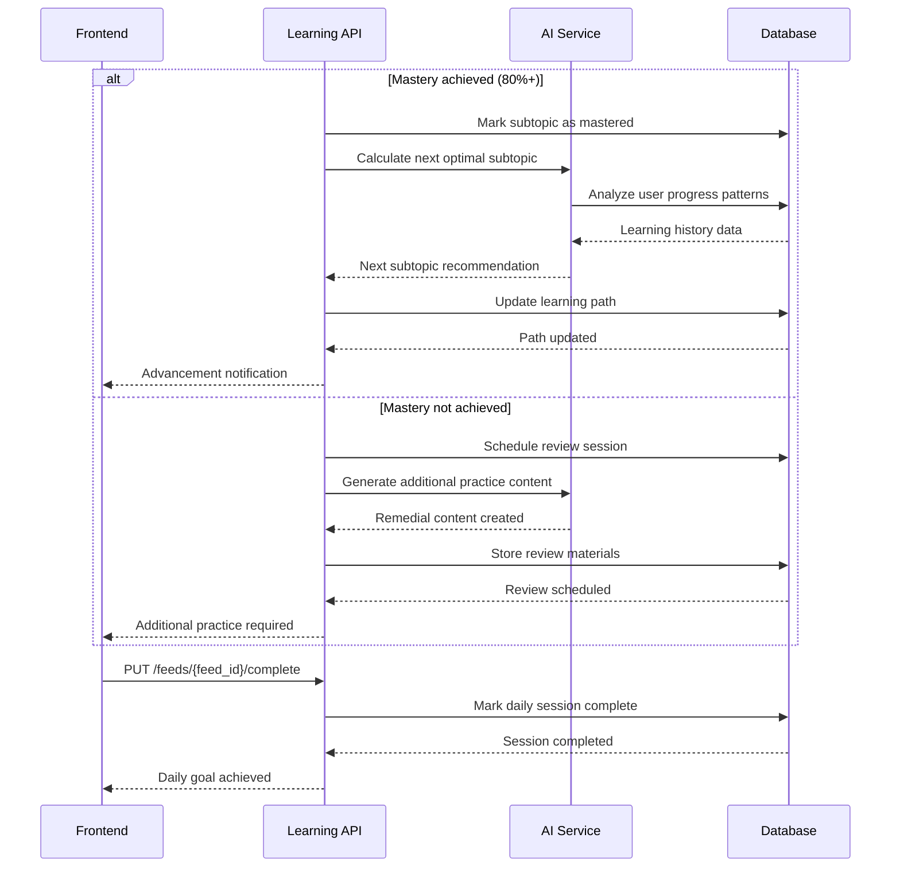
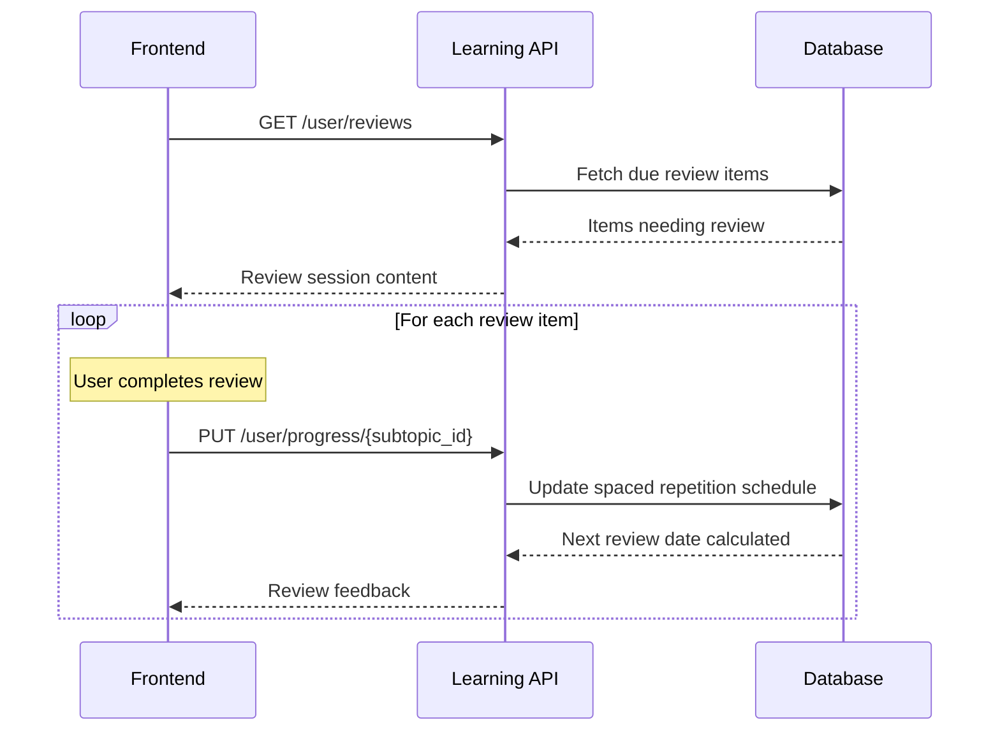
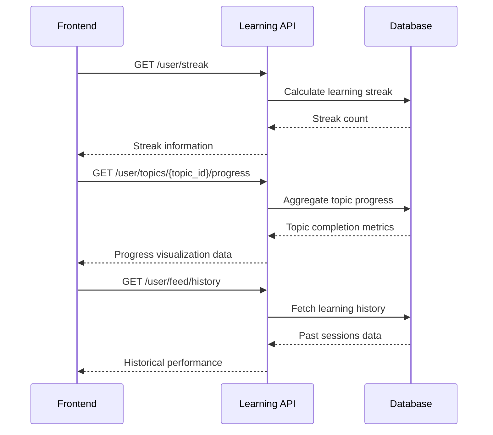

# 🎯 Frontend Learning Flow - API Sequence & Mental Model

## 📋 Overview

This document outlines the complete learning journey from a frontend perspective, detailing every API call, database interaction, and the ideal user experience flow for the Adaptive Daily Tech Learning System.

---

## 🔄 Complete Learning Journey

### Phase 1: User Onboarding & Setup

#### 1.1 Initial Authentication Flow


**API Calls:**
- `POST /auth/register` - Create new user account
- `POST /auth/login` - Authenticate existing user

**Purpose:** Establish user identity and session management

**Database Impact:** Creates/validates `users` table record

---

#### 1.2 Topic Selection & Subscription


**API Calls:**
- `GET /topics` - Fetch all available learning topics
- `POST /user/topics` - Subscribe user to selected topics

**Purpose:** Allow users to choose their learning domains

**Database Impact:** 
- Reads from `topics` table
- Creates records in `user_topics` table

---

### Phase 2: Daily Learning Experience

#### 2.1 Dashboard Load & Today's Feed


**API Calls:**
- `GET /user/dashboard` - Load user progress overview
- `GET /user/feed/today` - Get today's personalized learning content

**Purpose:** Show user's learning state and provide daily content

**Database Impact:**
- Reads from `users`, `user_topics`, `user_subtopic_progress`, `learning_sessions`
- May create `daily_feeds` record if none exists

---

#### 2.2 Article Reading Experience


**API Calls:**
- `POST /sessions` - Start learning session tracking
- `PUT /sessions/{session_id}` - Mark article as read

**Purpose:** Track reading engagement and completion

**Database Impact:**
- Creates record in `learning_sessions` table
- Updates session with completion status and time

---

#### 2.3 Flashcard Generation & Practice


**API Calls:**
- `POST /subtopics/{subtopic_id}/generate-content` - Generate AI flashcards
- `GET /subtopics/{subtopic_id}/content` - Retrieve flashcards
- `PUT /user/progress/{subtopic_id}` - Record flashcard attempts

**Purpose:** Active recall practice with AI-generated content

**Database Impact:**
- Creates records in `generated_content` table
- Updates `user_subtopic_progress` with attempt data

---

#### 2.4 Quiz Challenge & Mastery Assessment


**API Calls:**
- `POST /content` - Generate quiz questions
- `PUT /user/progress/{subtopic_id}` - Submit quiz answers
- `GET /user/progress/{subtopic_id}` - Get mastery assessment

**Purpose:** Test understanding and calculate mastery level

**Database Impact:**
- Creates quiz records in `generated_content` table
- Updates `user_subtopic_progress` with quiz scores
- Triggers mastery calculation algorithms

---

#### 2.5 Progress Update & Next Topic Selection


**API Calls:**
- `PUT /feeds/{feed_id}/complete` - Mark daily learning complete
- AI-driven next topic selection (internal process)

**Purpose:** Advance learning path or schedule reviews

**Database Impact:**
- Updates `user_subtopic_progress` mastery status
- May update `user_topics` with next subtopic
- Updates `daily_feeds` completion status

---

### Phase 3: Ongoing Engagement & Analytics

#### 3.1 Spaced Repetition Reviews


**API Calls:**
- `GET /user/reviews` - Get items due for spaced repetition
- `PUT /user/progress/{subtopic_id}` - Record review performance

**Purpose:** Reinforce previously learned concepts

**Database Impact:**
- Reads from `user_subtopic_progress` where review_date <= today
- Updates review intervals based on performance

---

#### 3.2 Progress Analytics & Insights


**API Calls:**
- `GET /user/streak` - Get current learning streak
- `GET /user/topics/{topic_id}/progress` - Topic-level progress
- `GET /user/feed/history` - Learning history

**Purpose:** Provide engagement insights and motivation

**Database Impact:**
- Complex queries across multiple tables for analytics
- Read-only operations for reporting

---

## 🎯 Mental Model Summary

### Core Database Relationships
```
users (1) ←→ (∞) user_topics ←→ (1) topics
topics (1) ←→ (∞) subtopics
users (1) ←→ (∞) user_subtopic_progress ←→ (1) subtopics
users (1) ←→ (∞) learning_sessions
users (1) ←→ (∞) daily_feeds
subtopics (1) ←→ (∞) generated_content
```

### Key State Transitions
1. **Unsubscribed** → Topic Selection → **Subscribed**
2. **New Subtopic** → Article Reading → **Reading Complete**
3. **Reading Complete** → Flashcards → **Practice Complete**
4. **Practice Complete** → Quiz → **Assessment Complete**
5. **Assessment Complete** → Mastery Check → **Mastered** | **Needs Review**
6. **Mastered** → Next Subtopic | **Needs Review** → Additional Practice

### Critical Success Metrics
- **Reading Completion Rate**: % of articles read fully
- **Flashcard Success Rate**: Average correct answers
- **Quiz Performance**: First-attempt success rate
- **Mastery Progression**: Subtopics mastered per week
- **Retention Rate**: Spaced repetition performance
- **Engagement Consistency**: Daily session completion

### AI Integration Points
- **Content Generation**: Articles, flashcards, quizzes
- **Difficulty Adjustment**: Based on user performance
- **Path Optimization**: Next topic selection
- **Personalization**: Content style and examples
- **Mastery Assessment**: Intelligent scoring algorithms

---

## 🚀 Implementation Priority

### Phase 1: Core Flow (Weeks 1-4)
- Authentication & topic selection
- Daily feed generation
- Article reading tracking
- Basic progress recording

### Phase 2: Interactive Learning (Weeks 5-8)
- AI content generation
- Flashcard system
- Quiz engine
- Mastery calculation

### Phase 3: Intelligence Layer (Weeks 9-12)
- Spaced repetition
- Advanced analytics
- Path optimization
- Performance insights

This mental model ensures every frontend interaction has a clear purpose, proper API backing, and measurable learning outcomes.